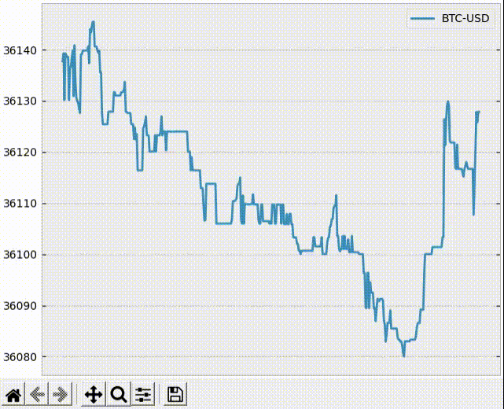

# coinbase-monitor

A Python script for monitoring products supported by [coinbase](https://pro.coinbase.com/) in real time

The script is written in Python and subscribes to the [websocket feed](https://github.com/danpaquin/coinbasepro-python) provided by coinbase. It leverages the APIs provided by an [unofficial Python client](https://github.com/danpaquin/coinbasepro-python) for coinbase. Users can select products they want to monitor and view live changes in their prices.

### Requirements

The script is tested with Python v3.8.2. It has the following dependencies:
- [cbpro](https://github.com/danpaquin/coinbasepro-python)
- [matplotlib](https://matplotlib.org)

The dependencies can be installed with the help of the `requirements.txt` file included in this repository.

```> pip3 install -r requirements.txt```

### Usage

```
usage: monitor.py [-h] [-f PLOTS_PER_FIG] [-i ANIMATION_INTERVAL] [-m MAXLEN] [-p PRODUCTS] [-s] [-c SELECT_CURRENCY] [-q]

Monitor prices of cryptocurrencies

optional arguments:
  -h, --help            show this help message and exit
  -f PLOTS_PER_FIG, --plots-per-fig PLOTS_PER_FIG
                        maximum number of plots per figure (default: 2)
  -i ANIMATION_INTERVAL, --animation-interval ANIMATION_INTERVAL
                        interval (in milliseconds) after which animation is updated (default: 1000)
                        Warning: low interval might increase resource usage
  -m MAXLEN, --maxlen MAXLEN
                        maxium number of data points to show on plots (default: 1000)
                        Warning: high number of data points might increase resource usage
  -p PRODUCTS, --products PRODUCTS
                        comma separated list of products to monitor (e.g., -p BTC-USD,ETH-USD,XLM-USD) (default: BTC-USD)
  -s, --show-supported-products
                        display products supported by coinbase (default: show all products; filter using --select-currency)
  -c SELECT_CURRENCY, --select-currency SELECT_CURRENCY
                        display products supported by coinbase in a specific quote currency (default: show all products; similar to --show-supported-products)
  -q, --show-supported-quote-currencies
                        display supported quote currencies
```

### Examples

By default, `BTC-USD` is monitored if no arguments are provided.

```
> python monitor.py
```


Additional products can be monitored via the `-p` switch.

```
> python monitor.py -p BTC-USD,ETH-USD
```


In fact, several products can be monitored at once.

```
python monitor.py -p BTC-USD,ETH-USD,BCH-USD,XLM-USD
```


By default, the script shows two plots per figure. However, this can be modified using the `-f` switch. In addition, the rate at which the plots are updated can be changed from the default of once every 1000 milliseconds to a user-defined value using the `-i` switch. Each plot retains $1000$ data points by default. Once more than $1000$ data points have been received, older data points are truncated. This value can be modified by providing a new value by using the `-m` switch.

```
> python monitor.py -p BTC-USD,ETH-USD,BCH-USD,XLM-USD -f 4 -i 100 -m 25
```


## Epilogue
Did you have fun using this script? Did you find issues? Reach out to me! I look forward to your feedback.